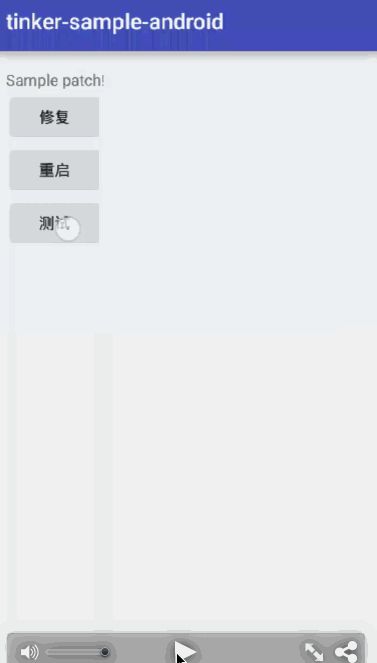
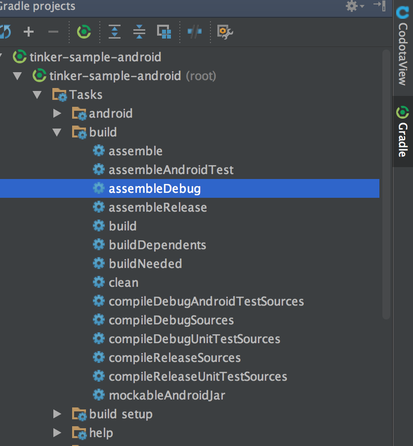
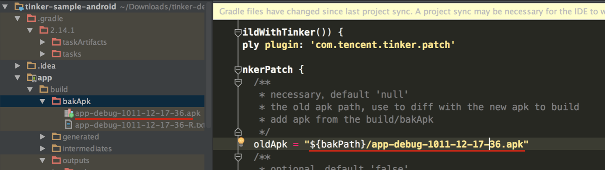
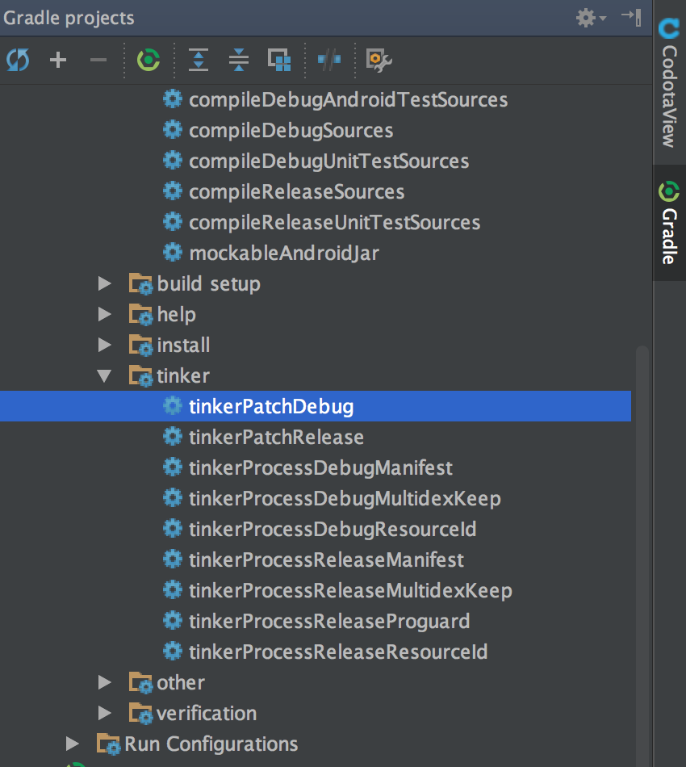

# Learning Tinker for Android 
这是一个基于腾讯热修复框架[Tinker](https://github.com/Tencent/tinker)的一个Demo，如果你没用过还真会遇到很多问题。我这里就针对官方文档里没有提到的细节和可能遇到的问题，以及构建的详细过程，给大家作个总结。


# 详解

1.项目导入Android Studio后，要加入版本控制，并提交一次，不然会报错。

2.如果你自己定义了Application，那需要把Application中的实现都移到DefaultApplicationLike的子类中，本例中就是SampleApplicationLike。

3.然后Application是由Tinker自动生成的，只需要指明类名。本类中的类名是`tinker.sample.android.app.SampleApplication`,然后别忘Manifest的Application加入name属性。

```
@DefaultLifeCycle(
application = "tinker.sample.android.app.SampleApplication",             //application name to generate
flags = ShareConstants.TINKER_ENABLE_ALL)                                //tinkerFlags above
public class SampleApplicationLike extends DefaultApplicationLike 
```

4.然后构件assembleDebug，会在bakApk文件下生成apk文件（记录下文件A）。然后运行到机子上，这里推荐使用真机作测试，这个就是有Bug的程序。  
  
5.修复程序中Bug。

6.然后修改app/build.gradle，文件就是刚刚的文件A。  
  
7.使用tinkerPatchDebug构建补丁，会生成patch—signed—7zip.apk补丁  
  
8.将补丁patch—signed—7zip.apk放在机子的 /storage/sdcard0/ 目录下。

```adb push ./app/build/outputs/tinkerPatch/debug/patch_signed_7zip.apk /storage/sdcard0/```  

9.修复Bug，重启，然后再测试。

##About me

An android developer in Beijing.Welcome to offer me an [Interview invitation](mailto:maat.xing@gmail.com). If you have any new idea about this project, feel free to [contact me](mailto:maat.xing@gmail.com). :smiley:


License
=======

    Copyright 2016 Maat


    Licensed under the Apache License, Version 2.0 (the "License");
    you may not use this file except in compliance with the License.
    You may obtain a copy of the License at

       http://www.apache.org/licenses/LICENSE-2.0

    Unless required by applicable law or agreed to in writing, software
    distributed under the License is distributed on an "AS IS" BASIS,
    WITHOUT WARRANTIES OR CONDITIONS OF ANY KIND, either express or implied.
    See the License for the specific language governing permissions and
    limitations under the License.


